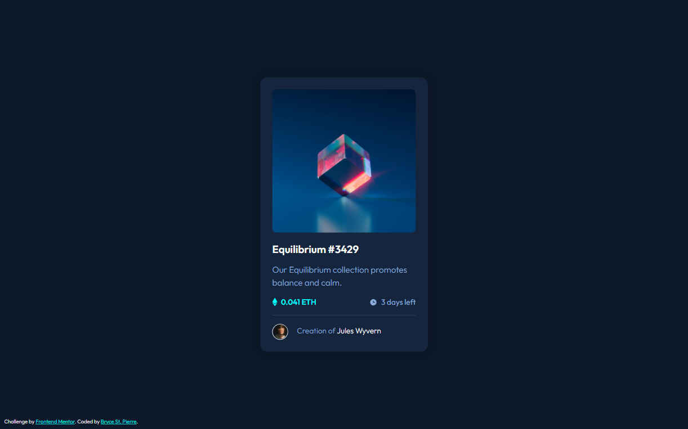

# Frontend Mentor - NFT preview card component solution

This is a solution to the [NFT preview card component challenge on Frontend Mentor](https://www.frontendmentor.io/challenges/nft-preview-card-component-SbdUL_w0U). Frontend Mentor challenges help you improve your coding skills by building realistic projects. 

## Table of contents

- [Overview](#overview)
  - [The challenge](#the-challenge)
  - [Screenshot](#screenshot)
  - [Links](#links)
- [My process](#my-process)
  - [Built with](#built-with)
- [Author](#author)

## Overview

### The challenge

Users should be able to:

- View the optimal layout depending on their device's screen size
- See hover states for interactive elements

### Screenshot



### Links

- Solution URL: [GitHub](https://github.com/BryceStPierre/fm-nft-preview-card)
- Live Site URL: [Netlify](https://bsp-nft-preview-card.netlify.app)

## My process

### Built with

- Semantic HTML5 markup
- BEM convention
- Mobile-first workflow

### What I learned

I was reminded of how to change the thickness of an `<hr>` element:

```css
hr {
  border: none;
  border-top: 1px solid var(--line) !important;
}
```

## Author

- Website - [Bryce St. Pierre](https://www.brycestpierre.com)
- Frontend Mentor - [@brycestpierre](https://www.frontendmentor.io/profile/brycestpierre)
- Twitter - [@brycestpierre](https://www.twitter.com/brycestpierre)
